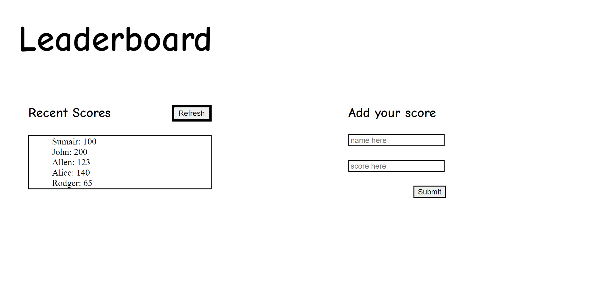

# Leaderboard

> An Api based application which adds and retrieves the scores from the leaderboard API.

## Built With

- Languages:
  - HTML, CSS, JS
-Frameworks:  
  - Webpack.
- Technologies:
  - Github, VS Code, Node.js

## Live Demo (if available)

[Live Demo Link](https://sumairq.github.io/leaderboard-api/))

## Getting Started

To get a local copy up and running follow these simple example steps.

### Prerequisites

Install Webpack package bundler.

### Setup

Clone this link [repo](https://github.com/sumairq/Todo-List-Microverse.git) to setup the repository.

### Install

run the following commands:
npm install webpack webpack-cli --save-dev
npm install --save-dev html-webpack-plugin
npm install --save-dev style-loader css-loader
npm install --save-dev webpack-dev-server

### Usage

Use the following commands to spin up the project.  
npm run start

## Authors

👤 **Sumair Qaisar Jadoon**

- GitHub: [@sumairq](https://github.com/sumairq)
- Twitter: [@sumair_qaisar](https://twitter.com/sumair_qaisar)
- LinkedIn: [LinkedIn](https://linkedin.com/in/sumair-qaisar-jadoon-84a877164)

## 🤝 Contributing

Contributions, issues, and feature requests are welcome!

Feel free to check the [issues page](../../issues/).

## Show your support

Give a ⭐️ if you like this project!

## Acknowledgments

- Hat tip to anyone whose code was used
- Inspiration
- etc

## 📝 License

This project is [MIT](./MIT.md) licensed.
